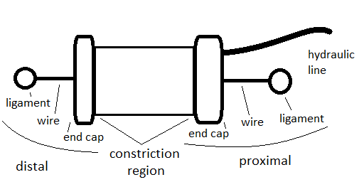

# Muscular System

## Description

A collection of muscles actuating the skeletal system.

## Composition

A muscle is cotractable soft actuator composed of:
- ligaments: durable wire attatched to a question mark screw or directly sewn onto skeleton
- distal end cap: two parametrically defined plastic parts holding contractable region to ligaments
- proximal end cap: two parametrically defined plastic parts holding contractable region to ligaments and connecting hydraulic fluid line
- contractable region: watertight flexible tubing surrounded by a plastic braided sleeve that collectively can contract under higher pressure or rest at full length
- hydraulic fluid line: flexible tubing that delivers hydraulic fluid
- small amount of glue: seals muscle seams

Parametrics for all muscles in the muscular system muscles are listed in the 'All_Muscles' spreadsheet in [musclar_system.FCStd](). Depending on their parameters, entries define muscles with varying diameters and lengths.

## Production

1 Purchase the required length/amount of items listed in the 'Purchase' spreadsheet in [musclar_system.FCStd]() by visiting the linked sources and entering the correct values. At times, notes are supplied to help.
2 3d print the required amount of [large distal end caps](large_distal_end_cap.stl), [large proximal end caps](large_proximal_end_cap.stl), [small distal end caps](small_distal_end_cap.stl), and [small proximal end caps](small_proximal_end_cap.stl), as directed by the '3D Print' spreadsheet in [musclar_system.FCStd][].
	- if you want to ensure fit, first print a few and test them with the tubing you ordered. Adjust parameters in 'Globals' spreadsheet in [musclar_system.FCStd][] as needed. Then reexport end cap .stl files. Please comment with parameters that worked with your sources. "Note that the master document [musclar_system.FCStd] must be loaded for the values in the master to be available to the dependent document [proximal and distal end cap FCStd files]." ([https://www.freecadweb.org/wiki/Expressions]())
3 Assemble muscles
4 Glue wires and tubing in place
5 Attatch to skeleton

## Interfaces

- hydraulic fluid lines: proximally connected with hydraulic system but defined as part of muscles
- ligaments: attatched to most bones without beforehand analysis. These are not defined in skeletal system. However, in some cases, precision demands the attatchment site specified on the bone design. In these cases, the interfacing attatchment site geometry is defined in the skeletal system but the ligament parts themselves are still defined under the muscle.
- contracted diameter: in some cases, negligable, but for larger muscles, may be factored in when specifying dimensions for integumentary system. Appropriate parameters defined in muscular system.